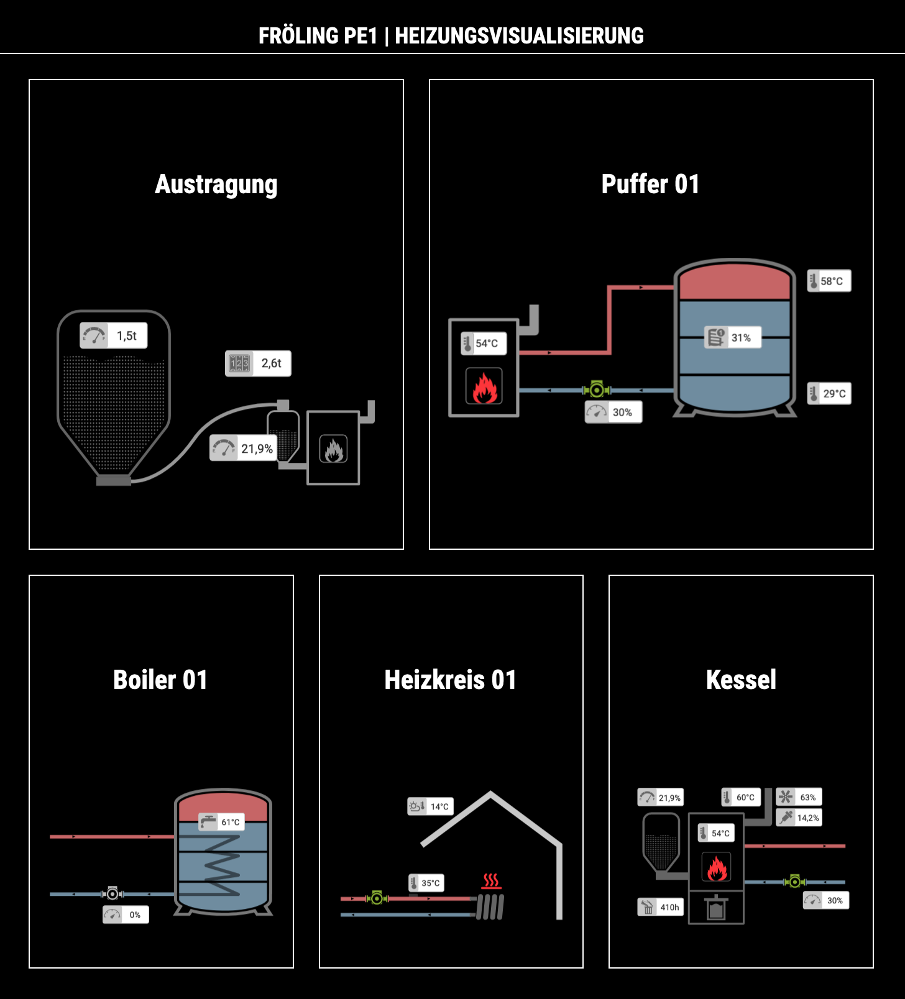

# MMM-FroelingConnect
Heating visualization module for [MagicMirror²](https://github.com/MichMich/MagicMirror). The module builds charts to your FRÖLING pellet boiler based on data from the [FRÖLING Connect API](https://connect-api.froeling.com). Inspiration and code base comes from [TA2k/ioBroker.froeling](https://github.com/TA2k/ioBroker.froeling).

## Screenshot


## Installation

In your terminal, go to your MagicMirror's Module folder:
````
cd ~/MagicMirror/modules
````

Clone this repository:
````
git clone https://github.com/eckonator/MMM-FroelingConnect.git
````

Install dependencies:
````
cd ~/MagicMirror/modules/MMM-FroelingConnect
````

````
npm install
````

Configure the module in your `config.js` file.

## Using the module

To use this module, add it to the modules array in the `config/config.js` file:
````javascript
modules: [
    {
        module: 'MMM-FroelingConnect',
        position: 'middle_center',
        header: 'FRÖLING PE1 / Heizungsvisualisierung',
        config: {
            username : 'youremail@provider.com', // FRÖLUNG Connect - APP Username or Email.
            password : 'yourPassword', // FRÖLUNG Connect - APP Password.
            interval : 5 // Interval in minutes how often the data should be fetched from the API.
        }
    }
]
````

## Configuration options

The following property can be configured:

| Option      | Description                                                            |        Default value         |
| ------------|------------------------------------------------------------------------|:----------------------------:|
| username    | FRÖLUNG Connect - APP Username or Email.                               | ```youremail@provider.com``` |
| password    | FRÖLUNG Connect - APP Password.                                        |      ```yourPassword```      |
| interval    | Interval in minutes how often the data should be fetched from the API. |           ```5```            |


